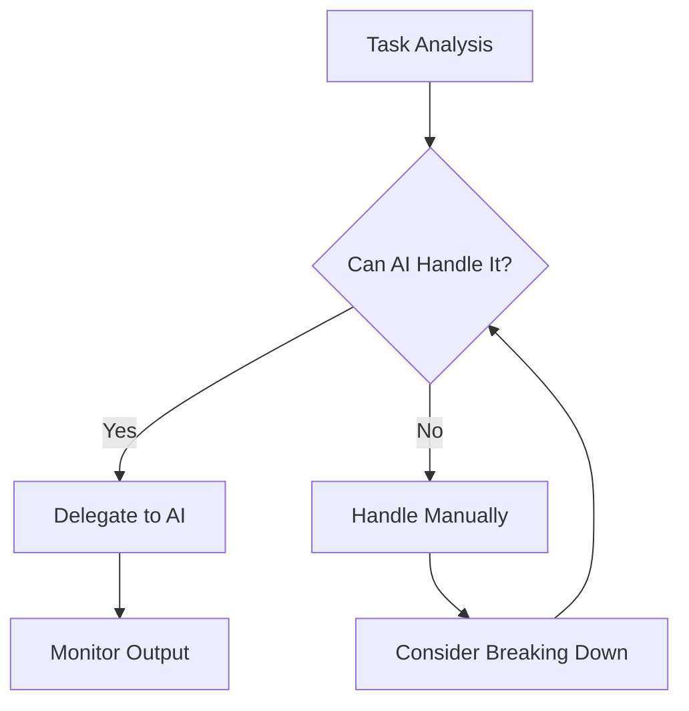

## **Introduction**

As AI-assisted programming becomes increasingly prevalent, developers are discovering that success with AI tools requires more than just technical prowess. In fact, the skills needed to effectively utilize AI for programming bear a striking resemblance to those of a Software Development Manager (SDM). This insight opens up a new perspective on how we should approach AI collaboration in software development.

## **The Core Insight: AI as a Team Member**

When we write prompts or comments for AI, we're essentially ensuring that our requests are well-defined and executable. This mirrors how SDMs structure tasks for their teams. The key questions we ask are remarkably similar:

- Is the problem properly defined?

- Does the AI (or team member) have sufficient context to complete the task?

- Can we reasonably expect successful implementation given the available resources?

These questions form the foundation of effective task delegation, whether to human developers or AI systems.

## **Five Essential Skills for AI-Assisted Programming**

### **1. Understanding Your Resources**

Just as SDMs must understand their team members' capabilities, developers need to grasp AI's capabilities and limitations:

**Technical Aspects:**

- Context window limitations

- Potential for hallucination

- Strengths in pattern recognition

- Weaknesses in logical consistency

**Motivation Strategies:**

- For AI: Effective prompt engineering, temperature settings, system context

- For comparison - Human teams: Career growth, recognition, technical challenges

### **2. Strategic Delegation**

Knowing when to delegate is crucial:



**Key Considerations:**

- Task complexity and scope

- Required domain knowledge

- Risk assessment

- Quality requirements

### **3. Effective Task Decomposition**

Breaking down complex problems is essential:

**Example Structure:**

1. Initial problem analysis

1. Component identification

1. Sequential prompt design

1. Integration planning

```python
# Example of task decomposition for AI
def complex_task(problem):
    # 1. Analysis
    requirements = ai.analyze_requirements(problem)
    
    # 2. Component Identification
    components = ai.break_down_into_components(requirements)
    
    # 3. Sequential Implementation
    for component in components:
        solution = ai.implement_component(component)
        validate_solution(solution)
    
    # 4. Integration
    return integrate_components(components)
```

### **4. Quality Assurance**

Implementing robust QA processes:

**Verification Strategies:**

- Automated testing (AI-assisted)

- Code review guidelines

- Performance benchmarking

- Security validation

### **5. Continuous Learning**

Establishing feedback loops:

**Learning Sources:**

- AI output analysis

- Error patterns

- Success cases

- Community feedback

## **The Evolution of Software Engineering**

This shift in skill requirements doesn't spell the end for traditional software engineering roles. Instead, it represents an evolution:

**Traditional Focus** → **New Focus**

- Algorithm implementation → System design

- Manual coding → Strategic problem solving

- Library knowledge → Architecture decisions

- Syntax mastery → AI collaboration skills

## **Historical Parallel: The Calculator Revolution**

The current AI transition mirrors the calculator's impact on mathematics:

**Before Calculators:**

- Emphasis on mental arithmetic

- Value placed on computation speed

- Complex manual calculation techniques

**After Calculators:**

- Focus on problem-solving

- Emphasis on mathematical thinking

- Higher-level mathematical exploration

Similarly, AI is shifting focus from implementation details to higher-level software design and architecture decisions.

## **Future Implications**

The role of software engineers is evolving, not disappearing. In fact, the emergence of AI is creating new opportunities and challenges that make skilled software engineers more valuable than ever. Let's explore the key areas where software engineers will continue to be essential:

### **1. System Architecture: The Foundation of Success**

The complexity of modern software systems demands architects who can:

- Design scalable systems that effectively integrate AI components

- Make critical decisions about where to deploy AI vs. traditional solutions

- Ensure system reliability while incorporating potentially non-deterministic AI behaviors

- Design robust fallback mechanisms for AI system failures

### **2. AI Collaboration Strategies: Beyond Basic Prompting**

Software engineers are developing sophisticated approaches to AI collaboration:

- Creating reusable prompt templates and libraries

- Developing middleware to optimize AI resource usage

- Building tools for prompt testing and validation

- Implementing AI output verification systems

### **3. Quality Assurance: Ensuring AI Reliability**

Modern QA has evolved to include:

- AI output validation frameworks

- Automated testing of AI-human interactions

- Performance monitoring of AI systems

- Security testing for AI-specific vulnerabilities

### **4. Problem Decomposition: The Art of Breaking Down Complexity**

Engineers are developing new methodologies for:

- Identifying AI-solvable components in complex problems

- Creating hybrid solutions combining AI and traditional approaches

- Managing AI context limitations through smart problem splitting

- Designing efficient workflows for AI-human collaboration

### **5. Technical Leadership: Guiding the AI Revolution**

Software engineers are becoming AI transformation leaders by:

- Developing AI adoption strategies for development teams

- Creating best practices for AI-assisted development

- Training teams on effective AI collaboration

- Making strategic decisions about AI tool integration

### **The Expanding Role of Software Engineers**

Rather than being replaced, software engineers are becoming:

1. **AI System Architects**: Designing robust, scalable systems that effectively integrate AI

1. **AI Collaboration Experts**: Developing best practices and patterns for AI-human teamwork

1. **Quality Guardians**: Ensuring AI systems meet reliability and security standards

1. **Problem Solving Strategists**: Making critical decisions about AI vs. traditional approaches

1. **Technical Leaders**: Guiding organizations through AI transformation

The key to success in this evolving landscape is not just technical skill, but the ability to:

- Think strategically about system design

- Understand both AI capabilities and limitations

- Make informed decisions about technology choices

- Lead teams through technological transformation

- Maintain focus on business value and user needs

## **Conclusion**

The AI-assisted programming era requires a new mindset - one that combines traditional software engineering skills with managerial competencies. By approaching AI collaboration with an SDM's perspective, developers can maximize the benefits of AI while maintaining high-quality software development practices.

Success in this new paradigm depends not on fighting against AI's capabilities, but on learning to manage and direct them effectively. The future belongs to those who can master this delicate balance of technical expertise and resource management.

## **Resources for Further Learning**

---

*Note: This article is part of my ongoing series on AI-assisted work. Stay tuned for more insights and practical guides.*
